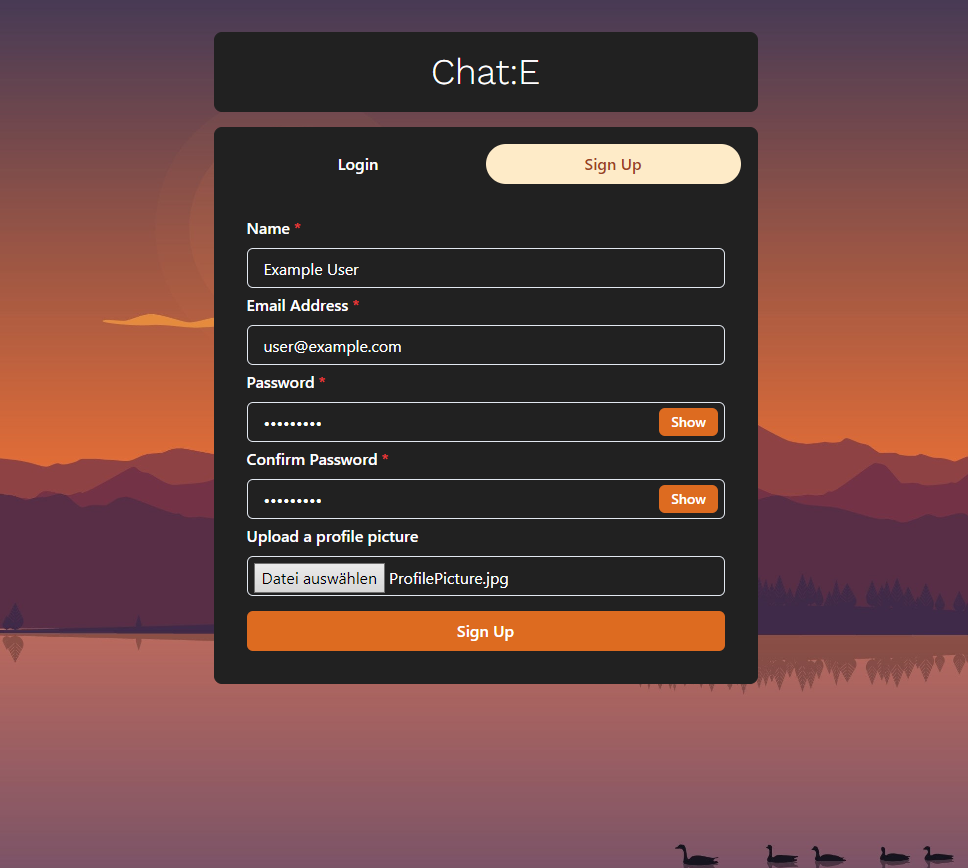
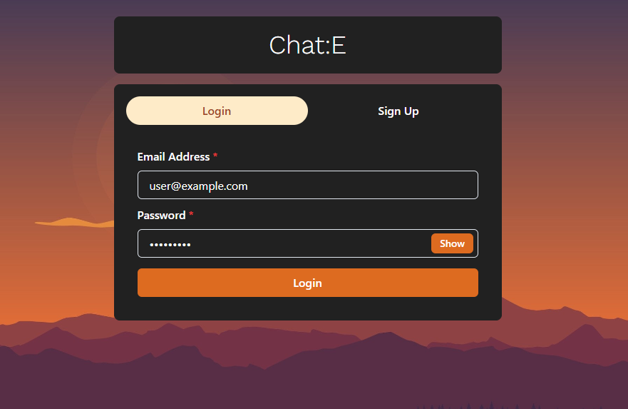
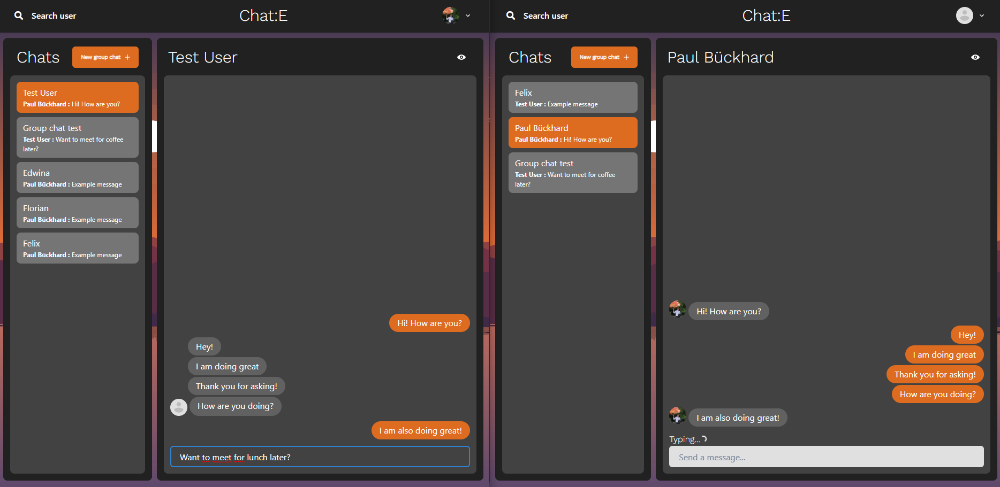
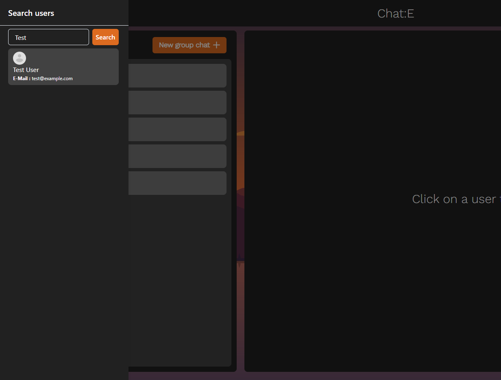
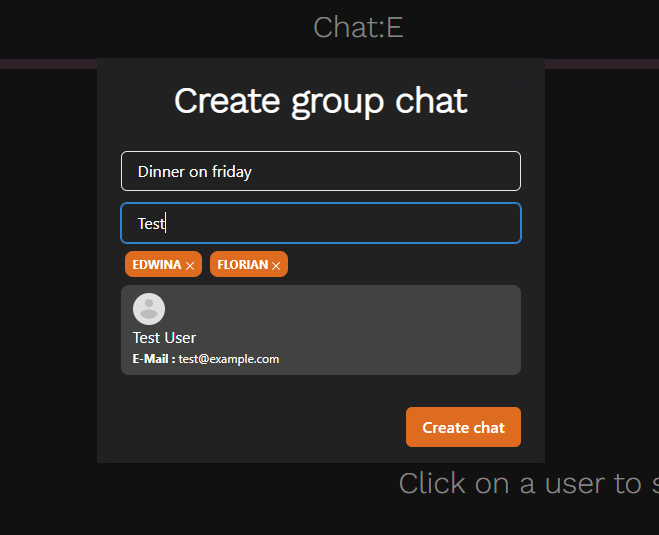
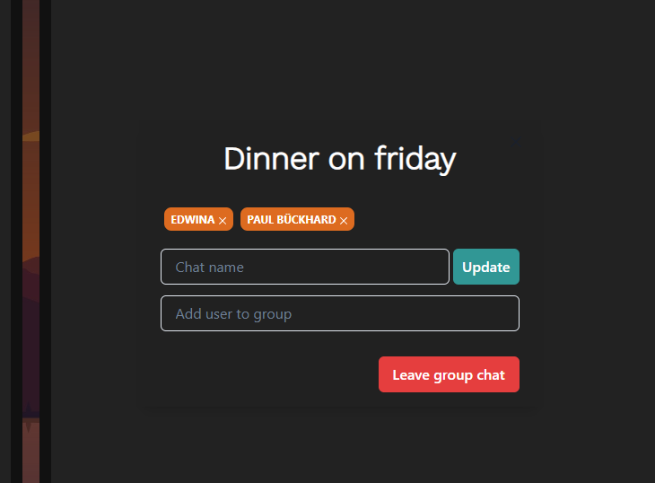
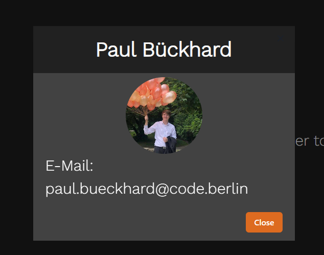
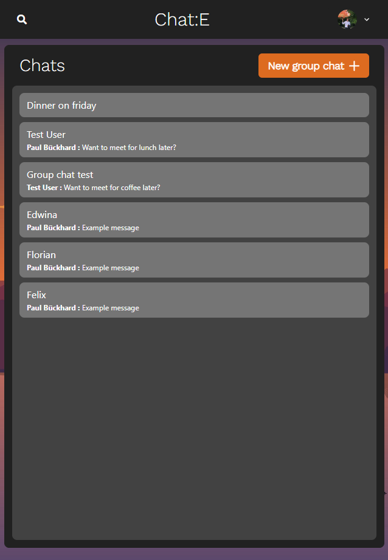
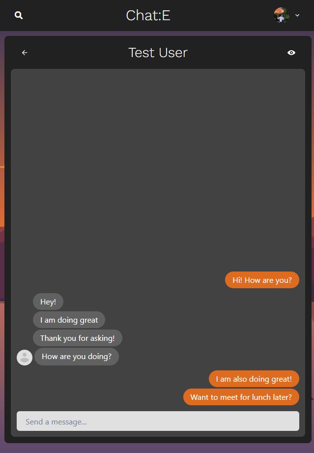

# Chat-E

Chat-E is a full stack, real-time chat application using [Socket.io](https://socket.io) for real time communication and stores user details in encrypted format in a [MongoDB](https://www.mongodb.com) database.

**Disclaimer**: This repository was optimized for deployment. To see the entire commit history visit [https://github.com/PaulBueckhard/Full-Stack-Chat-App](https://github.com/PaulBueckhard/Full-Stack-Chat-App)

---

This document describes the general structure of this project, how to set it up, and the features of this app.

For a more in-depth documentation on the **frontend** visit the [frontend](https://github.com/PaulBueckhard/Chat-E/tree/master/frontend).

For a more in-depth documentation on the **backend** visit the [backend](https://github.com/PaulBueckhard/Chat-E/tree/master/backend).

## Tech stack

**Client**: [ReactJS](https://react.dev)

**Server**: [ExpressJS](https://expressjs.com), [NodeJS](https://nodejs.org/en)

**Database**: [MongoDB](https://www.mongodb.com)

**Hosting**: [Render](https://render.com)

## Setup

Go to [https://chat-e.onrender.com](https://chat-e.onrender.com) to see the app running live. Sign up with a new account and start chatting.

---

Alternatively, to run the application locally:

Clone this repository

    git clone https://github.com/PaulBueckhard/Chat-E

Go to project directory

    cd Chat-E

Install all dependencies

    npm install

    cd frontend/
    npm install

Start the server

    npm start

Start the client

    //open new terminal
    cd frontend/
    npm start

Go to `frontend/src/components/SingleChat.js` and change the `ENDPOINT` URL to “http://localhost:5000”. Create a new .env file in the root directory and include the following:

    PORT=5000
    MONGO_URI=<Your MongoDB URI>
    JWT_SECRET=<Your JWT secret>
    NODE_ENV=development

You should now be able to access Chat-E in your browser at “http://localhost:5000”.

---

To test the real-time functionality, open another browser and log in with the following credentials:

**E-mail**: test@example.com

**Password**: 123456

And start a chat with yourself.

## Features

### Authentication

### Real-time chatting with typing indicators

### Search users

### Create group chats

### Add or remove users from group

### View user profiles

### Mobile responsiveness

