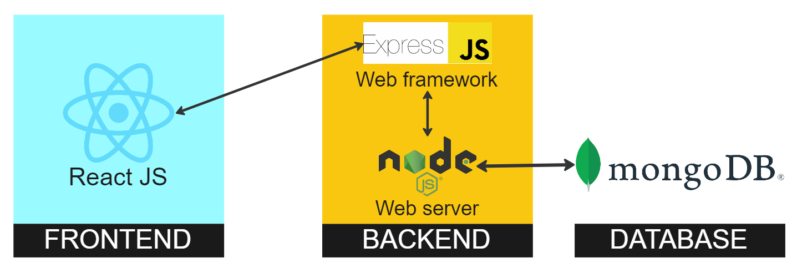
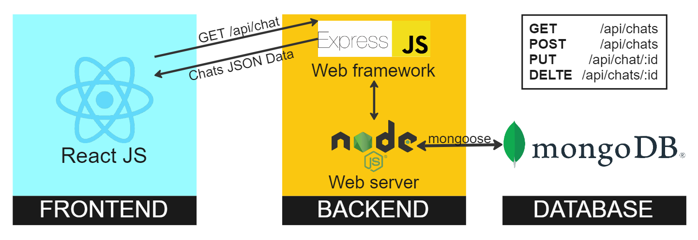

# Chat-E frontend

This document describes the structure of this project's frontend, its components and intentions.

For a more general documentation of the **project** visit the [root](https://github.com/PaulBueckhard/Chat-E).

For a more in-depth documentation on the **backend** visit the [backend](https://github.com/PaulBueckhard/Chat-E/tree/master/backend).

## Architecture

## Functionality

The frontend serves as this project's client, interpreting and displaying the server's data to the user using [ReactJS](https://legacy.reactjs.org) and improving user experience using [Chakra UI](https://chakra-ui.com). It consists of:

### Pages

Files that are responsible for the general rendering of the homepage and chatpage

### Components

- **Sign up** handles the rendering of the sign up tab and whether given data is valid and complete
- **Login** handles the rendering of the login tab and whether given data is complete

---

- **Single chat** renders the chat interface for a single chat session where users can type and send messages. It provides real-time message updates and typing indicators
- **Scrollable chat** provides a scrollable container for all messages and provides them with the profile picture of their user
- **My chats** renders the left-hand box where all of the user's available chats are provided with the **chat boxes**
- **Chatbox** renders the reusable, selectable chatboxes that are available to the user in **my chats**

---

- **Side drawer** renders the bar on top of the page with the current user's profile and the option to log out and the tab to search for users displaying the **user list items**
- **Profile modal** renders the reusable user's information tab. The name, e-mail and profile picture are provided
- **Group chat modal** renders and handles the tab to create a new group chat
- **Update group chat modal** renders the reusable tab with the group chat information. It also handles sending API requests about removing and adding people to a group and renaming the chat
- **Chat loading** renders a loading animation when searching for users

---

- **User list item** renders the reusable user box when users are searched for
- **User badge item** renders the reusable user badge in the group chat info tab

### Context

The chatcontext provider serves as a component wrap to provide the ability to access state information. It declares the different state variables of the user, selected chat and all chats by accessing the current browser history from their browser's local storage. With the user info it decides whether users are instantly directed to the chatpage or homepage.

### Chat logic

- **Get sender** indicates which user in the chat sent the message
- **Get sender full** is the same as **get sender** but returns the full user object instead
- **Is same sender** indicates whether the current message and next message were from the same user
- **Is last message** indicates whether the current message is the last in the chat and whether it was sent by the current user
- **Is same sender margin** handles the positioning of every message based on what user sent it
- **Is same user** indicates whether the current message has the same sender as the previous message

## Rendering

In production mode the frontend is rendered using `npm run build` to generate a production-ready bundle that can be deployed to the server. It generates static assets that can be served to users when they visit the website, resulting in faster load times.

## Reasoning

I used ReactJS for this application because of the ability to create reusable components easily and the usage of virtual DOM. The virtual DOM enables a representation of the UI that is kept in memory and synced with the actual DOM to reduce loading times.

React came with Chakra UI which made it easy to use pre-built and pre-designed components for better looking and more efficient functionality visualisation. It was easier to make the app more accessable by making it more responsive and intuitive.

My general UI and colour-palette choices were a dark theme with orange accents. The main purpose was to give the app a warm and comfortable feeling while keeping it simple and functional.

## Request flow

When the user makes a request on the client to e.g. access their chats, the frontend sends this request to the web framework, which interprets the request and redirects it to the webserver. The webserver makes a query to the database to receive every chat.

The database compiles the query and sends the data back to the webserver, which redirects it to the web framework, which then sends it to the frontend in the form of JSON data. The frontend interprets the data and displays it to the user.
